# KodeIn - Flutter Learning App 📱

## 📱 About The Project

KodeIn is a comprehensive mobile application designed to help users learn programming through structured courses and interactive content. Built with Flutter, this cross-platform app provides a seamless learning experience with courses, quizzes, and progress tracking.

### ✨ Features

- **Interactive Courses**: Access a variety of programming courses with structured content
- **Chapter-based Learning**: Learn step by step with well-organized chapters
- **Quizzes & Assessments**: Test your knowledge with interactive quizzes
- **Task Management**: Keep track of your learning tasks and progress
- **User Authentication**: Secure login and registration system
- **Responsive UI**: Beautiful and intuitive interface for all screen sizes

## 🛠️ Built With

- **Framework**: Flutter
- **State Management**: Built-in Flutter State Management
- **UI/UX**: Material Design 3
- **Icons**: Material Icons

## 🚀 Getting Started

### Prerequisites

- Flutter SDK (latest stable version)
- Dart SDK
- Android Studio / Xcode (for emulator/simulator)
- VS Code or Android Studio (recommended IDEs)

### Installation

1. Clone the repository
   ```bash
   git clone https://github.com/dikysetiawan21/kodein.git
   cd kodein
   ```

2. Install dependencies
   ```bash
   flutter pub get
   ```

3. Run the app
   ```bash
   flutter run
   ```

## 📱 App Screens

| Splash Screen | Welcome | Login |
|--------------|---------|-------|
| 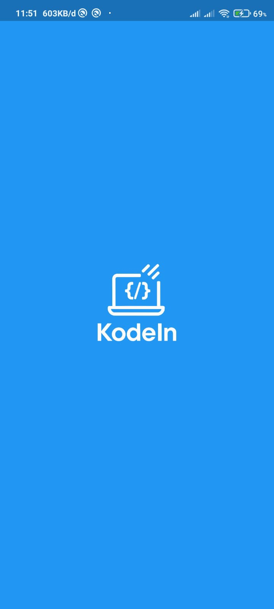 | 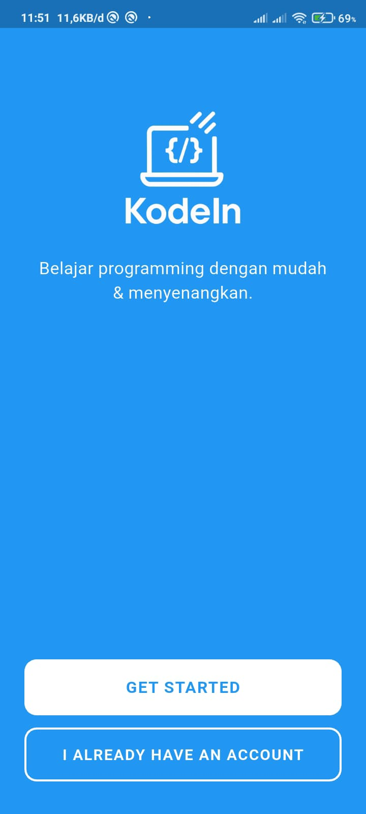 | 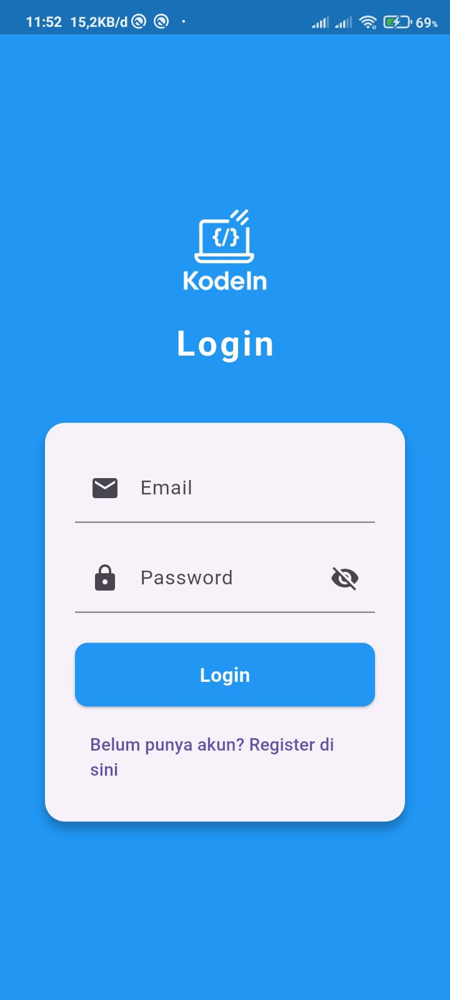 |

| Register | Home | Courses |
|----------|------|---------|
| 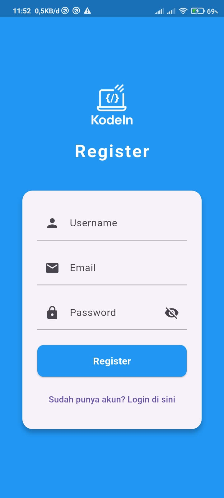 | 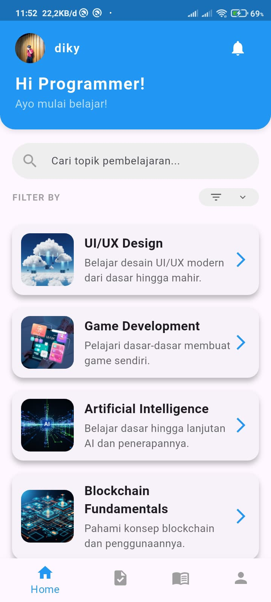 | 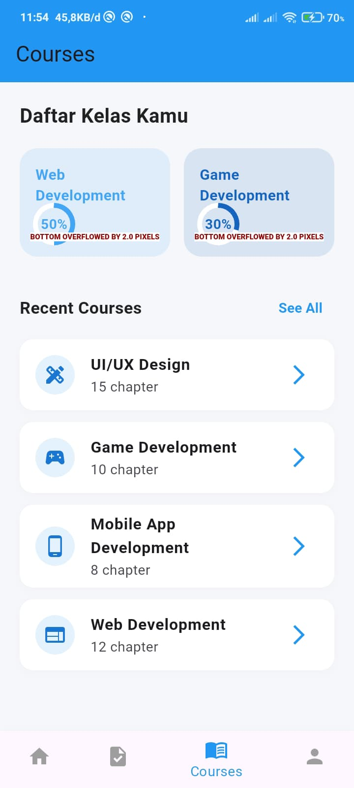 |

| Course Details | Chapter Details | Quiz |
|----------------|-----------------|------|
| 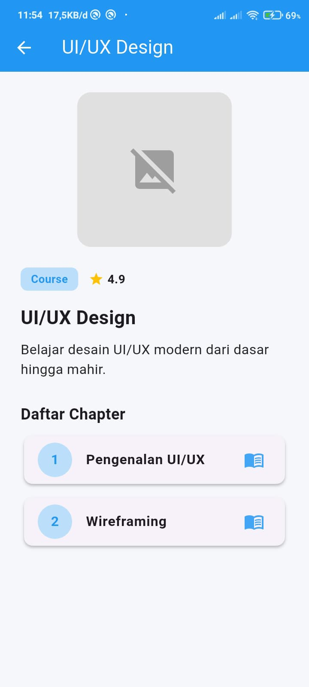 | 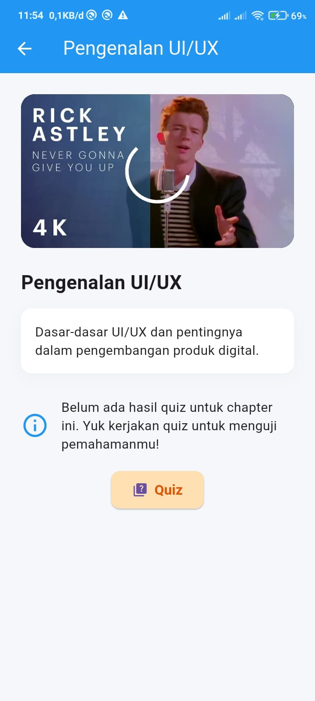 | 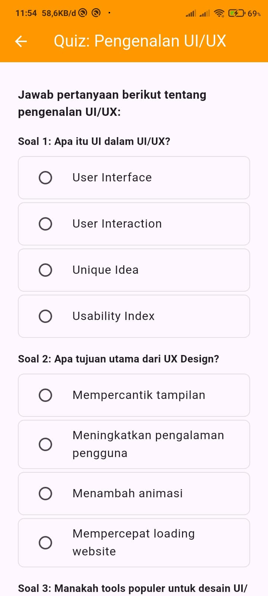 |

| Quiz Results | Tasks | Add Task | Filter |
|--------------|-------|----------|--------|
| 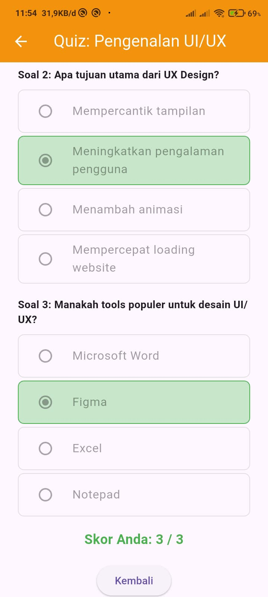 | 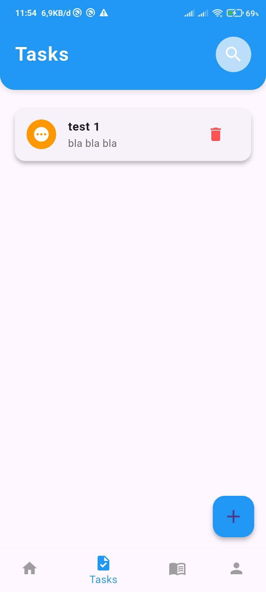 | 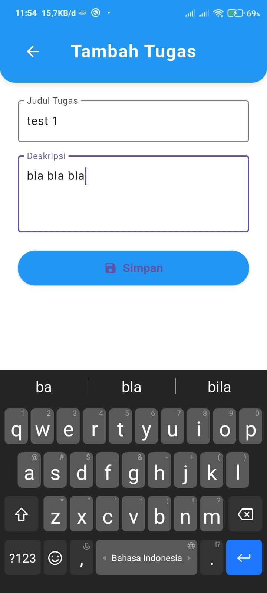 | 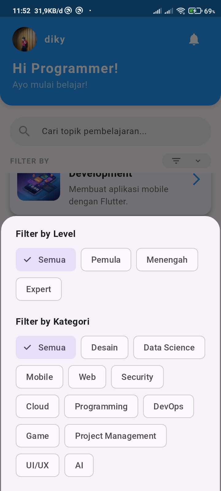 |

| Profile |
|----------|
| 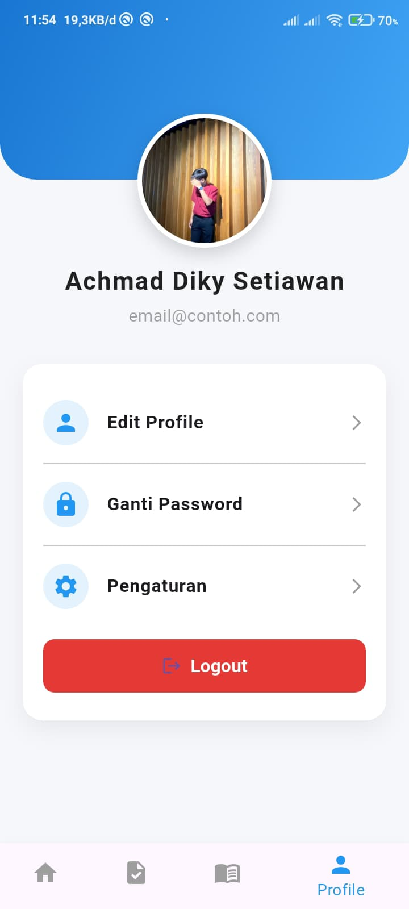 |

## 🎯 Key Features in Detail

### 1. Comprehensive Learning Path
- Structured courses with multiple chapters
- Progress tracking for each course
- Interactive learning materials

### 2. Interactive Quizzes
- Test your knowledge after each chapter
- Immediate feedback on answers
- Track your learning progress

### 3. Task Management
- Create and manage learning tasks
- Set deadlines and priorities
- Mark tasks as complete

## 🤝 Contributing

Contributions are what make the open-source community such an amazing place to learn, inspire, and create. Any contributions you make are **greatly appreciated**.

1. Fork the Project
2. Create your Feature Branch (`git checkout -b feature/AmazingFeature`)
3. Commit your Changes (`git commit -m 'Add some AmazingFeature'`)
4. Push to the Branch (`git push origin feature/AmazingFeature`)
5. Open a Pull Request

## 📝 License

Distributed under the MIT License. See `LICENSE` for more information.

## 👨‍💻 Author

**Diky Setiawan**  
📧 Email: achmaddikys21@gmail.com  
🔗 GitHub: [@dikysetiawan21](https://github.com/dikysetiawan21)  
💼 LinkedIn: [Achmad Diky Setiawan](linkedin.com/in/achmaddikysetiawan)

## 🙏 Acknowledgments

- [Flutter](https://flutter.dev/) - Beautiful native apps in record time
- [Material Design 3](https://m3.material.io/) - Design system
- [Font Awesome](https://fontawesome.com/) - For the beautiful icons

---

<div align="center">
  <p>Made with ❤️ by You</p>
  <p>© 2025 KodeIn. All rights reserved.</p>
</div>

